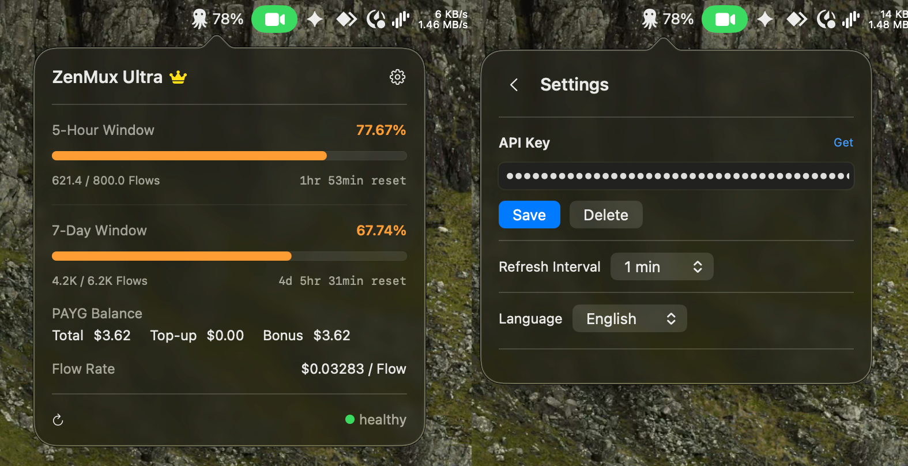

# ZenMux Monitor

[](LICENSE)

[](../../releases)

English Version | [中文版本](./README_CN.md)

## What is ZenMux?

[ZenMux](https://zenmux.ai/invite/1C3QLF) is a unified LLM aggregator — one API key to access ChatGPT / Claude / Gemini / DeepSeek / GLM and other mainstream models from Google, DeepSeek, and more. Features smart model routing, automatic failover, and an insurance-backed compensation mechanism for output quality issues — making it secure, stable, and cost-effective.

## What is ZenMux Monitor?

A lightweight macOS menu bar app for monitoring [ZenMux](https://zenmux.ai/invite/1C3QLF) subscription quotas and usage in real time.



## Features

- Resides in the menu bar, showing the current 5-hour quota usage percentage
- Left-click the icon to open the usage panel: 5-hour / 7-day quota progress bars, PAYG balance, Flow rate
- Right-click the icon for a context menu: Refresh, Settings, Quit
- Color-coded usage warnings (green / orange / red)
- API Key stored securely in macOS Keychain
- Configurable auto-refresh interval (1 / 5 / 15 / 30 minutes)
- English and Simplified Chinese UI, auto-detected from system language

## Installation

Download the latest DMG from the [Releases](../../releases) page, then drag **ZenMux Monitor** to your Applications folder.

> Since the app is not signed with an Apple Developer certificate, macOS may show a warning that the app is "damaged" and cannot be opened. To fix this, run the following command in Terminal:
>
> ```bash
> sudo xattr -rd com.apple.quarantine "/Applications/ZenmuxMonitor.app"
> ```
>
> After that, you can open the app normally.

## Configure API Key

1. Get your Management API Key from the [ZenMux Management Panel](https://zenmux.ai/platform/management)
2. Left-click the menu bar icon → click the gear icon → paste your API Key → Save
 
## Requirements

- macOS 14.0 (Sonoma) or later
- Xcode 16.0 or later (for development)

## Development

The project uses [XcodeGen](https://github.com/yonaskolb/XcodeGen) to manage the Xcode project file:

```bash
# Install XcodeGen (if not already installed)
brew install xcodegen

# Generate .xcodeproj
xcodegen generate

# Open in Xcode
open ZenmuxMonitor.xcodeproj
```

Or build from the command line:

```bash
xcodebuild -scheme ZenmuxMonitor -configuration Debug build
```

## Tech Stack

- Swift 6.0 / SwiftUI / AppKit
- `@Observable` macro + `NSStatusItem` + `NSPopover`
- Security.framework (Keychain)
- Zero third-party dependencies

## Contributing

Contributions are welcome! Please read the [Contributing Guide](./CONTRIBUTING.md) for details.

## Changelog

See [CHANGELOG.md](./CHANGELOG.md) for a list of changes.

## Security

If you discover a security vulnerability, please report it privately. See [SECURITY.md](./SECURITY.md) for details.

## License

This project is licensed under the MIT License — see the [LICENSE](LICENSE) file for details.
